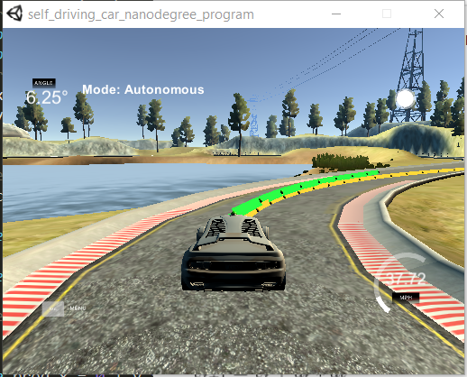

# CarND-Controls-MPC
Self-Driving Car Engineer Nanodegree Program

---


I implemented a MPC  controller in c++ in this project.



### Introduction

Kinematic model is used in MPC. 

- Global Kinematic Model

<a href="https://www.codecogs.com/eqnedit.php?latex=\begin{aligned}&space;x_{t&plus;1}&space;&=&space;x_t&space;&plus;&space;v_t&space;*&space;cos(\psi_t)&space;*&space;dt&space;\\&space;y_{t_1}&space;&=&space;y_t&space;&plus;&space;v_t&space;*&space;sin(\psi_t)&space;*&space;dt&space;\\&space;\psi_{t&plus;1}&space;&=&space;\psi_t&space;&plus;&space;\frac{v_t}{L_f}&space;*&space;\delta&space;*&space;dt&space;\\&space;v_{t&plus;1}&space;&=&space;v_t&space;&plus;&space;a_t&space;*&space;dt&space;\end{aligned}" target="_blank"></a>

`[x, y, psi, v]` is the state of the vehicle, Lf is a physical characteristic of the vehicle

`[delta, a]` are the steer value and throttle to the system.


Consider the errors in the kinematic model, the new state is [x, y, psi, v, cte, epsi]

- Cross track error

<a href="https://www.codecogs.com/eqnedit.php?latex=\begin{aligned}&space;cte_{t&plus;1}&space;&=&space;cte_t&space;&plus;&space;v_t&space;*&space;sin(e\psi_t)&space;*&space;dt&space;\\&space;cte_t&space;&=&space;y_t&space;-&space;f(x_t)&space;\\&space;cte_{t&plus;1}&space;&=&space;y_t&space;-&space;f(x_t)&space;&plus;&space;v_t&space;*&space;sin(e\psi_t)&space;*&space;dt&space;\end{aligned}" target="_blank"></a>

`y_t - f(x_t)` is current cross track error

`v_t * sin(epsi_t) * dt` is the change in error caused by the vehicle's movement.


- Orientation error

<a href="https://www.codecogs.com/eqnedit.php?latex=\begin{aligned}&space;e\psi_{t&plus;1}&space;&=&space;e\psi_t&space;&plus;&space;\frac{v_t}{L_f}&space;*&space;\delta_t&space;*&space;dt&space;\\&space;e\psi_t&space;&=&space;\psi_t&space;-&space;\psi&space;des_t&space;\\&space;e\psi_{t&plus;1}&space;&=&space;\psi_t&space;-&space;\psi&space;des_t&space;&plus;&space;\frac{v_t}{L_f}&space;*&space;\delta_t&space;*&space;dt&space;\end{aligned}" target="_blank"></a>

`psi_t - psides_t` is current orientation error.

`v_t/Lf * delta * dt` is  the change in error caused by the vehicle's movement.


### Dependencies

* cmake >= 3.5
 * All OSes: [click here for installation instructions](https://cmake.org/install/)
* make >= 4.1(mac, linux), 3.81(Windows)
  * Linux: make is installed by default on most Linux distros
  * Mac: [install Xcode command line tools to get make](https://developer.apple.com/xcode/features/)
  * Windows: [Click here for installation instructions](http://gnuwin32.sourceforge.net/packages/make.htm)
* gcc/g++ >= 5.4
  * Linux: gcc / g++ is installed by default on most Linux distros
  * Mac: same deal as make - [install Xcode command line tools]((https://developer.apple.com/xcode/features/)
  * Windows: recommend using [MinGW](http://www.mingw.org/)
* [uWebSockets](https://github.com/uWebSockets/uWebSockets)
  * Run either `install-mac.sh` or `install-ubuntu.sh`.
  * If you install from source, checkout to commit `e94b6e1`, i.e.
    ```
    git clone https://github.com/uWebSockets/uWebSockets
    cd uWebSockets
    git checkout e94b6e1
    ```
    Some function signatures have changed in v0.14.x. See [this PR](https://github.com/udacity/CarND-MPC-Project/pull/3) for more details.

* **Ipopt and CppAD:** Please refer to [this document](https://github.com/udacity/CarND-MPC-Project/blob/master/install_Ipopt_CppAD.md) for installation instructions.
* [Eigen](http://eigen.tuxfamily.org/index.php?title=Main_Page). This is already part of the repo so you shouldn't have to worry about it.
* Simulator. You can download these from the [releases tab](https://github.com/udacity/self-driving-car-sim/releases).
* Read the [DATA.md](./DATA.md) for a description of the data sent back from the simulator.


## Basic Build Instructions

1. Clone this repo.
2. Make a build directory: `mkdir build && cd build`
3. Compile: `cmake .. && make`
4. Run it: `./mpc`.

